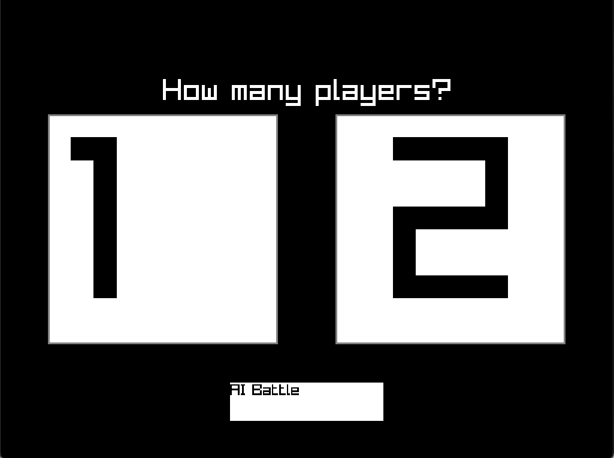

## ShallowMind ChessAI

* [**NOTE** ***CASTLING*** has **not** *yet* been implemented](#castling).

### Description
* ShallowMind ChessAI is a one and two player MacOS desktop application.

### How to Play?
* **One** player: Click one player, select your colour, and begin playing against ShallowMind!
* **Two** player: Click two player and pass the computer to the person playing with the white pieces.

### Controls
#### Mouse
* `LEFT CLICK`: Select Piece / Move Piece.
#### Keyboard
*  `CMD + Z`: undo move.

### Screenshots



### Links
 - youtube.com: [YouTube Video](https://www.youtube.com/watch?v=kNM1cPyCSfA&t=26s)
 - itch.io: [ShallowMind Chess AI](https://badongo.itch.io/shallowmind-chessai)

### Developers
 - Brendan Michael Lynch - Application Designer.
 - Chess assets are courtesy of [Wildlife Studios](https://wildlifestudios.itch.io/chess-set-pixel-art)

> *Copyright (c) 2024 Brendan Lynch github/brendanml*

## Playing the Game!
### Option 1: Clone the repository to your and run as executable.
```zsh
cd ~/Downloads

git clone https://github.com/brendanml/ShallowMind_ChessAI.git

cd ShallowMind_ChessAI/src

./app
```
### Option 2: Download on [itch.io](https://badongo.itch.io/shallowmind-chessai)
- **IMPORTANT**: Apple will make the app as ***DAMAGED*** as I am not a certified app developer. You will need to run `"xattr -cr <path/to/ShallowMind.app>"` in terminal to be able to play the game.


## Notes On Development

### Inspiration
- I was motivated to write my own Chess AI because I love chess and I took an AI at university.

### How I built it...
- C++, raylib, statically built
- apple application bundle

### Things I've Learned
- Things are always more challenging to implement than to plan...
- git forking
- C++ object structuring
- command pattern

#### Castling
* Castling is not currently possible... I began coding with an incomplete understanding of the problem, I will try and detail this below.
  * I implemented the majority of the code logic by selecting a piece (origin) & another square (desination) and if the piece is capable of moving there... move the origin piece to the desintation square.
  * Castling, obviously, does not follow this pattern...
    * The majority of the code logic runs on the origin & destination pattern, and altering it breaks: person movements, AI movements and decision logic & check scenarios.

### What's next for ShallowMind
- Plan on creating a fork re-writing a large portion of the code base in order to both clean-up the codebase as well as make moves like castling possible.

### ShallowMind
- ShallowMind is a heuristic-based AI that is only concerned with the current board state (does not consider results of it's actions).

